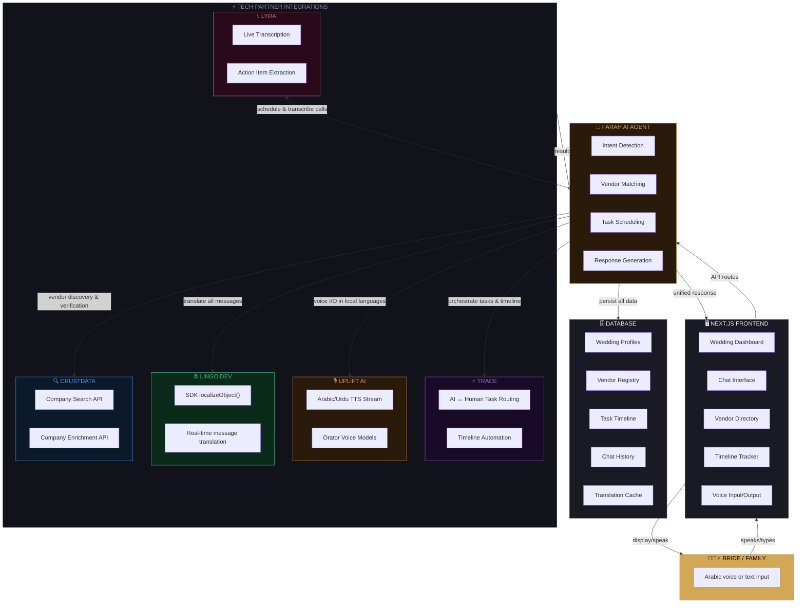
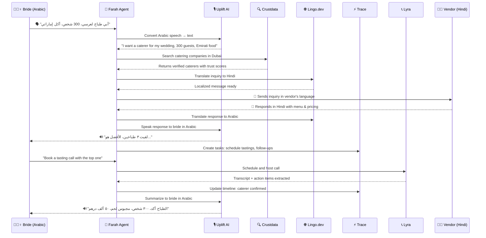

<div align="center">

# فرح — Farah

**AI-Powered Emirati Wedding Planner**

*VIBE26 UAE Hackathon Submission*

</div>

---

Farah is a hackathon MVP for planning Emirati weddings: vendor discovery + verification, multilingual coordination, and an automated planning timeline.

Emirati weddings are complex (separate men's and women's events, many vendors, strict scheduling, and privacy constraints). Today this is managed through scattered WhatsApp messages and manual follow-ups. Farah centralizes the workflow and reduces miscommunication across languages.

## What it does (MVP)

- **Wedding intake**: side (men/women), guest count, budget, category (e.g., catering)
- **Verified vendor discovery**: vendors ranked by reliability signals (trust layer)
- **Multilingual messaging**: send inquiries and view responses in the user's language
- **Voice + text support**: vendor voice notes and text are translated back to the planner
- **Timeline brain**: auto-generates a planning timeline and follow-ups (booked/paid/confirmed)

## Demo flow

1. User submits requirements (Arabic supported).
2. Farah returns a ranked list of verified vendors with reliability indicators.
3. User sends inquiries to top vendors; each vendor receives the message in their language.
4. Vendors reply (text/voice); Farah translates and extracts key details (price, availability).
5. Farah updates the timeline and schedules confirmations/follow-ups automatically.

## Architecture



## Data flow



## Tech partner usage

| Partner | Role | Integration |
|---------|------|-------------|
| **Crustdata** | Vendor intelligence | Company Search & Enrichment APIs — verify legitimacy, size, age, growth signals |
| **Lingo.dev** | Translation layer | SDK for real-time message translation (AR ↔ EN ↔ HI ↔ UR ↔ TL) + UI localization |
| **Uplift AI** | Voice interface | Orator TTS/STT — bride speaks Arabic, vendors speak their language |
| **Trace** | Workflow orchestration | Routes tasks between AI and humans, manages wedding timeline |
| **Lyra** | Meeting intelligence | Vendor consultation calls with transcription and action item extraction |

## Tech stack

- **Frontend**: Next.js + React
- **Backend**: Next.js API routes
- **Database**: SQLite (dev) / Postgres (prod)
- **Integrations**: Crustdata, Lingo.dev, Uplift AI, Trace, Lyra (mocked where API access is pending)

## Repo structure

```
farah/
├── README.md
├── package.json
├── next.config.js
├── .env.example
│
├── public/
│   └── assets/                 # logos, icons, demo images
│
├── src/
│   ├── app/
│   │   ├── layout.tsx          # root layout + fonts
│   │   ├── page.tsx            # landing / wedding intake form
│   │   ├── dashboard/
│   │   │   └── page.tsx        # main wedding dashboard
│   │   ├── vendors/
│   │   │   └── page.tsx        # vendor discovery + cards
│   │   ├── chat/
│   │   │   └── page.tsx        # multilingual chat interface
│   │   └── timeline/
│   │       └── page.tsx        # planning timeline view
│   │
│   ├── components/
│   │   ├── IntakeForm.tsx      # wedding requirements form
│   │   ├── VendorCard.tsx      # vendor with trust score badge
│   │   ├── ChatBubble.tsx      # message bubble with language tag
│   │   ├── VoiceInput.tsx      # record + send voice notes
│   │   ├── TimelineItem.tsx    # task with status (booked/paid/confirmed)
│   │   └── LanguageSwitcher.tsx
│   │
│   ├── lib/
│   │   ├── crustdata.ts        # Crustdata API client
│   │   ├── lingo.ts            # Lingo.dev SDK wrapper
│   │   ├── uplift.ts           # Uplift AI voice client
│   │   ├── trace.ts            # Trace workflow client
│   │   ├── lyra.ts             # Lyra meeting client
│   │   ├── agent.ts            # Farah agent — intent routing + orchestration
│   │   └── db.ts               # database client
│   │
│   ├── api/
│   │   ├── vendors/
│   │   │   └── route.ts        # GET: search vendors, POST: send inquiry
│   │   ├── chat/
│   │   │   └── route.ts        # POST: send/receive translated messages
│   │   ├── voice/
│   │   │   └── route.ts        # POST: voice note → text → translate
│   │   ├── timeline/
│   │   │   └── route.ts        # GET: tasks, POST: create, PATCH: update status
│   │   └── meetings/
│   │       └── route.ts        # POST: book call, GET: transcript
│   │
│   └── types/
│       └── index.ts            # shared TypeScript types
│
├── prisma/
│   └── schema.prisma           # DB schema (weddings, vendors, tasks, messages)
│
└── mocks/
    ├── vendors.json            # sample vendor data for demo
    └── responses.json          # sample translated responses
```

## Team

| Name | Role | Email |
|------|------|-------|
| | | |
| | | |
| | | |

---

<div align="center">

**Built at VIBE26 UAE Hackathon 🇦🇪**

</div>
